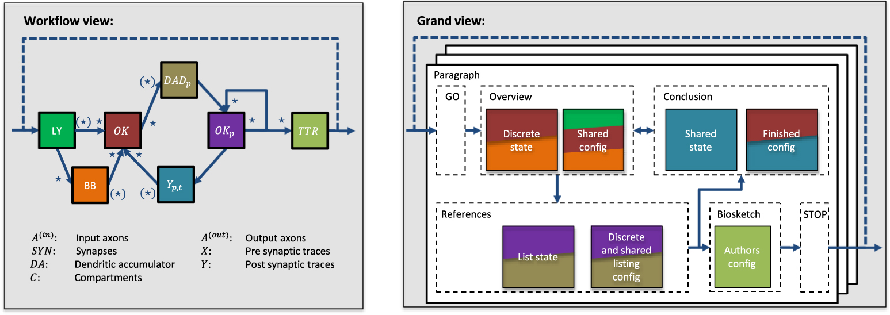

This introduction should provide background information (including
relevant references) and should indicate the purpose of the manuscript.
Cite relevant work by others, including research outside your company or
institution. Place your work in perspective by referring to other
researchpapers.

This document is a template for file type LaTeX. If you are reading a
paper or PDF version of this document, please download the electronic
file, CsMag template.tex, from the IEEE Template Selector at
[template-selector.ieee.org](https://template-selector.ieee.org) so you
can use it to prepare your manuscript. Articles that are math heavy are
encouraged to use the LaTeX version of thetemplate.

In the header at the top of page 1, please indicate whether your article
is a Theme Article, Feature Article, or Department submission. If it is
a Theme Article, include the special issue title as the description. If
it is a Feature Article, please provide a 3-4 word phrase reflecting the
topic of the article. If it is a Department submission, please name
thedepartment.

COPYRIGHT AND OPEN ACCESS
=========================

Upon acceptance, all CS magazine corresponding authors must complete
IEEE's Electronic Copyright Form (eCF), which will be prompted at the
start of the production process. Further details about IEEE's copyright
policies are available at
[www.ieee.org/publications/rights/index.html](https://www.ieee.org/publications/rights/index.html).

CS magazines now offer an open access model for full-length research
articles (departments are not eligible for open access). At the time of
submission to the ScholarOne peer review portal, authors will have the
option to indicate that they will pay for open access. Should the
article be accepted, authors will receive information on how to proceed
with payment and licensing. More information on the hybrid open access
program for magazines can be found at
[open.ieee.org/index.php/about-ieee-open-access/faqs](https://open.ieee.org/index.php/about-ieee-open-access/faqs).

FONTS
=====

This template utilizes Adelle Sans for body text and and Computer Modern
for math.

![Note that "Figure" is spelled out. There is a period after the figure
number, followed by one space. It is good practice to briefly explain
the significance of the figure in the caption. (From \["Title"\],$^1$
used with permission.)](fig1.jpg){width="18.5pc"}

SECTIONS
========

Sections following the introduction should present results and findings.
To find your publication's word count requirements and limits, navigate
to your magazine's homepage from
[www.computer.org/csdl/magazines](https://www.computer.org/csdl/magazines),
then click Write for Us $>$Author Information. The manuscript should be
written so that each sentence, equation, figure, and table flow smoothly
and logically. Relevant work by others, as well as relevant products
from other companies, should be adequately and accurately cited (see the
Reference Style section). Sufficient support should be provided (or
cited) for the assertions made and conclusions drawn.

Headings are unnumbered with no ending punctuation.

MAGAZINE STYLE
==============

Use American English when writing the paper. The serial comma should be
used ("a, b, and c" not "a, b and c"), and periods and commas appear
within quotation marks, like "this period." Other punctuation is placed
"outside"! Avoid the use of technical jargon, slang, and vague or
informal English. Generic technical terms should instead be used, as
magazine articles are meant to be understandable by a broad readership.

Acronyms and Abbreviations
--------------------------

All acronyms should be defined at first mention in the abstract and in
the main text. Define in figures and tables only if not defined in the
discussion of the figure/table. Acronyms consist of capital letters
(except where salted with lowercase), but the terms they represent need
not be given initial caps unless a proper name is involved ("central
processing unit" (CPU) but "Fourier transform" (FT)). Use of "e.g." and
"i.e." is okay in parenthetical statements, but avoid using "etc."

Abbreviate units of time (s, min, hr, mo, yr) only in virgule
constructions and in artwork; otherwise, spell out (e.g., 3 months,
25 minutes). Units of measure (such as Kb, MB, kWh) should always be
abbreviated when used with a numeral; if used alone, spell out ("16 MB
of RAM" but "these values are measured in micrometers").

  ---------- ------------------------------------------- -----------------------------------------------------------------
  Symbol     Quantity                                    Conversion from Gaussian and CGS EMU to SI$^{\mathrm{a}}$
  $\Phi$     Magnetic flux                               1 Mx $\to  10^{-8}$ Wb $= 10^{-8}$ V $\cdot$ s
  $B$        Magnetic flux density, magnetic induction   1 G $\to  10^{-4}$ T $= 10^{-4}$ Wb/m$^{2}$
  $H$        Magnetic field strength                     1 Oe $\to  10^{-3}/(4\pi )$ A/m
  $m$        Magnetic moment                             1 erg/G $=$ 1 emu $\to 10^{-3}$ A $\cdot$ m$^{2} = 10^{-3}$ J/T
  $M$        Magnetization                               1 erg/(G $\cdot$ cm$^{3}) =$ 1 emu/cm$^{3}$ $\to 10^{-3}$ A/m
  4$\pi M$   Magnetization                               1 G $\to  10^{-3}/(4\pi )$ A/m
                                                         
  ---------- ------------------------------------------- -----------------------------------------------------------------

  : Units for magnetic properties.[]{label="table"}

[\[tab1\]]{#tab1 label="tab1"}

Numbers
-------

Spell out numerals up to ten that have no unit of measure or time (one,
two ten), but always use numerals with units of time and measure. Some
examples are as follows: 11 through 999; 1,000; 10,000; 20th century;
twofold, tenfold, 20-fold; two times; 0.2 cm; $p=.001$; 25%; 10% to 25%.

MATH AND EQUATIONS
==================

Use either the Microsoft Equation Editor or the MathType plugin, which
can be obtained from
https://store.wiris.com/en/products/mathtype/download. For help with
formatting and placing equations, refer to the IEEE Editing Math Guide
at
<http://journals.ieeeauthorcenter.ieee.org/wp-content/uploads/sites/7/Editing-Mathematics.pdf>
and the IEEE MathType Tutorial for Microsoft Word Users at
<http://journals.ieeeauthorcenter.ieee.org/wp-content/uploads/sites/7/IEEE-Math-Typesetting-Guide-for-MS-Word-Users.pdf>.

Scalar *variables* and *physical constants* should be italicized, and a
bold (non-italics) font should be used for **vectors** and **matrices**.
Do not italicize subscripts unless they are variables.

Equations should be either display (with a number in parentheses) or
inline.

If a display equation cannot be centered, the first line can be made
flush left to the column to allow more room for the following lines of
the equation.

Be sure the symbols in your equation have been defined before the
equation appears or immediately following. Please refer to "Equation
(1)," not "Eq. (1)" or "equation (1)."

Punctuate display equations when they are part of the sentence preceding
it, as in $$A=\pi r^2$$

If the text following the equation flows logically as a part of the
display equation, such as $$a^2 + b^2 = c^2,$$ treat the display
equation as you would inline text, using punctuation after the equation
as necessary.

LISTS
=====

If you use a list, keep it short:

-   *Style for bulleted lists*---This is the style that should be used
    for bulleted lists.

-   *Punctuation in lists*---Each item in the list should end with a
    period, regardless of whether full sentences are used.

-   *Punctuation in lists*---Each item in the list should end with a
    period.

{width="26pc"}

FIGURES AND TABLES
==================

In-Text Callouts for Figures and Tables
---------------------------------------

Figures and tables must be cited in the running text in consecutive
order. Figure callouts should be Roman, not bold or italic, like this:
"see Figure 1." Figure 2 shows an example of a figure spanning two
columns.

Vertical lines are optional in tables. Footnotes should be indicated by
a, b, c, d, and so on, per the *Chicago Manual of Style* (see Table 1).
Statements that serve as captions for the entire table do not need
footnote letters.

Authors are responsible for obtaining permission to reprint previously
published figures or tables. Required permission information should be
included in the figure/table caption, for instance: "From
'\[Title\],'$^1$ with permission," or "Adapted from '\[Title\],'$^2$
with permission." *Carefully* explain each figure in the text. To find
your publication's figure limit, if applicable, navigate to your
magazine's homepage from
[www.computer.org/csdl/magazines](https://www.computer.org/csdl/magazines)
and click Write for Us $>$ Author Information.

REFERENCE STYLE
===============

References must be cited in text. They appear as superscript outside the
punctuation, and are listed in the References section in the order that
they appear in text. Do not refer to the reference number or use "Ref."
or "reference" in text. Instead of writing "References 3--5
show$\ldots$," construct the sentence independently of its reference
callout; for example, "The XYZ study shows$\ldots$."$^{3-5}$ Please do
not use automatic endnotes in Word; rather, type the reference list at
the end of the paper using the "References" style.

Reference numbers are set flush left and form a column of their own,
hanging out beyond the body of the reference. The reference numbers are
on the line and end with period. In all references, the given name of
the author or editor is abbreviated to the initial(s) only and precedes
the last name. Include all names; use *et al*. only if names are more
then six. Use commas around Jr., Sr., and III in names. Abbreviate
conference titles. When citing IEEE magazines or transactions, provide
the issue number, page range, volume number, year, and/or month if
available. When referencing a patent, provide the day and the month of
issue or application. Please obtain and include relevant reference
information. Do not combine references. There must be only one reference
with each number. If there is a URL included with the print reference,
it can be included at the end of the reference. When citing a preprint,
please include the Digital Object Identifier (DOI).

Other than books, capitalize only the first word in a paper title,
except for proper nouns and element symbols. For papers published in
translation journals, please give the English citation first, followed
by the original foreign-language citation. See the end of this document
for formats and examples of common references.

APPENDIX SECTION
================

Appendix is moved to supplementary material if it is not
discussed/referenced in the main text. If it is discussed in the text,
it is set as a sidebar.

SUPPLEMENTARY MATERIAL
======================

If supplementary material is provided in the article, then it is
deleted. A pointer to the supplemental material will be added to the
first callout in the article and the phrase "available online" will be
added to all subsequent callouts.

Examples:
---------

### First Callout:

See the Appendix, which is available in the IEEE Computer Society
Digital Library at
<http://doi.ieeecomputersociety.org/10.1109/MCSE.2019.2947017>.

For detailed algorithms, please refer to the supplementary materials,
which can be found in the Computer Society Digital Library at
<http://doi.ieeecomputersociety.org/10.1109/MCSE.2019.2947017>.

### Second Callout:

More experimental results are presented in the supplementary materials,
available online, due to the space limitation.

CONCLUSION
==========

The manuscript should include future directions of the research. Authors
are strongly encouraged not to reference multiple figures or tables in
the conclusion; these should be referenced in the body of the paper.

ACKNOWLEDGMENTS
===============

The Acknowledgments is always plural even if there is a single
acknowledgment. The author(s) would like to thank A, B, and C. This work
was supported by XYZ under Grant \#\#\#.

The "Acknowledgments" (spelled with just two e's, per American English)
section appears immediately after the conclusion and before the
reference list. Sponsor and financial support are included in the
acknowledgments section. For example: "This work was supported in part
by the U.S. Department of Commerce under Grant BS123456." If support for
a specific author is given, then use the following example for correct
wording. "The work of First A. Author was supported by the U.S.
Department of Commerce under Grant BS123456". Researchers that
contributed information or assistance to the article should also be
acknowledged in this section, and expressions should be simple and
expressed as "We thank$\ldots$," rather than indicating which of the
authors is doing the thanking. Also, if corresponding authorship is
noted in the paper, it should be placed in the bio of the corresponding
author.

1

G. M. Amdahl, G. A. Blaauw, and F. P. Brooks, "Architecture of the IBM
System/360," *IBM J. Res. Dev*., vol. 8, no. 2, pp. 87--101, 1964.
(journal)

IBM Corporation, IBM Knowledge Center - IBM Secure Service Container
(Secure Service Container). \[Online\]. Available:
https://www.ibm.com/support/knowledgecenter/en/HW11R/com.ibm.hwmca.kc\_se.doc/introductiontotheconsole/wn2131zaci.html
(URL)

J. Williams, "Narrow-band analyzer," PhD dissertation, Dept. Elect.
Eng., Harvard Univ., Cambridge, MA, USA, 1993. (Thesis or dissertation)

J. M. Pérez, R. Berlanga, M. J. Aramburu, and T. B. Pedersen,
"Integrating data warehouses with web data: A survey," *IEEE Trans.
Knowl. Data Eng*., early access, Dec. 21, 2007,
doi:10.1109/TKDE.2007.190746. (preprint)

W.-K. Chen, *Linear Networks and Systems*. Belmont, CA, USA: Wadsworth,
1993, pp. 123--135. (Book)

S. P. Bingulac, "On the compatibility of adaptive controllers," in
*Proc. 4th Ann. Allerton Conf. Circuits Syst. Theory*, 1994, pp. 8--16.
(Conference proceedings)

K. Elissa, "An overview of decision theory," unpublished. (Unpublished
manuscript)

R. Nicole, "The last word on decision theory," *J. Comput. Vis.*,
submitted for publication. (Pending publication)

C. J. Smith and J. S. Smith, Rocky Mountain Research Laboratories,
Boulder, CO, USA, private communication, 1992. (Private communication)

First A. Author All biographies are limited to one paragraph, following
the structure given here: each author's current role and institution (to
match the first page of the article); three to five current research
interests; highest degree, topic, and awarding institution (do not
include year); professional memberships, such as the IEEE Computer
Society and any grade information; and contact information in the form
of an email address.

Second B. Author, Jr.,  is a researcher at the ABC Corporation,
Böblingen, Germany. Her current research interests include a, b, and c.
Author received the Ph.D. degree in physics from University. She is a
Fellow of the IEEE Computer Society. Contact her at sbauthor\@abc.com.

Third C. Author, III,   is a program officer at the DEF Corporation,
Tokyo, Japan. His research interests include p, q, and r. Author
received the Ph.D. degree in computer vision from University. He is a
member of the IEEE Computer Society. Contact him at tcauthor\@def.com.
